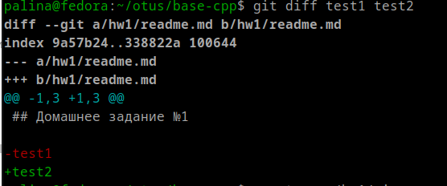

## Домашнее задание №1

Репозиторий git создан на уровень выше, то есть не hw1, а base-cpp/hw1. 

В нём и созданы две ветки test1 и test2 с разными версиями файла readme.

- отработка команды diff

- полезная страничка по git

https://habr.com/ru/articles/905658/
